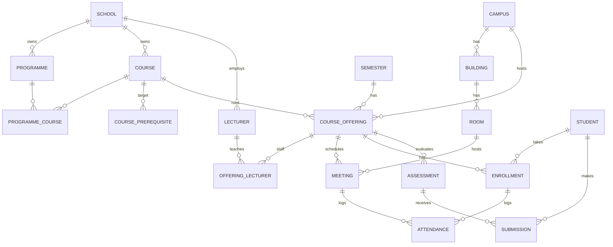

```mermaid
erDiagram
  CAMPUS ||--o{ BUILDING : has
  BUILDING ||--o{ ROOM : has
  SCHOOL ||--o{ PROGRAMME : owns
  SCHOOL ||--o{ COURSE : owns
  SCHOOL ||--o{ LECTURER : employs
  PROGRAMME ||--o{ PROGRAMME_COURSE : ""
  COURSE ||--o{ PROGRAMME_COURSE : ""
  COURSE ||--o{ COURSE_PREREQUISITE : target
  SEMESTER ||--o{ COURSE_OFFERING : has
  CAMPUS ||--o{ COURSE_OFFERING : hosts
  COURSE ||--o{ COURSE_OFFERING : runs
  COURSE_OFFERING ||--o{ OFFERING_LECTURER : staff
  LECTURER ||--o{ OFFERING_LECTURER : teaches
  COURSE_OFFERING ||--o{ MEETING : schedules
  ROOM ||--o{ MEETING : hosts
  STUDENT ||--o{ ENROLLMENT : takes
  COURSE_OFFERING ||--o{ ENROLLMENT : has
  COURSE_OFFERING ||--o{ ASSESSMENT : evaluates
  ASSESSMENT ||--o{ SUBMISSION : receives
  STUDENT ||--o{ SUBMISSION : makes
  ENROLLMENT ||--o{ ATTENDANCE : logs
  MEETING ||--o{ ATTENDANCE : logs
```
